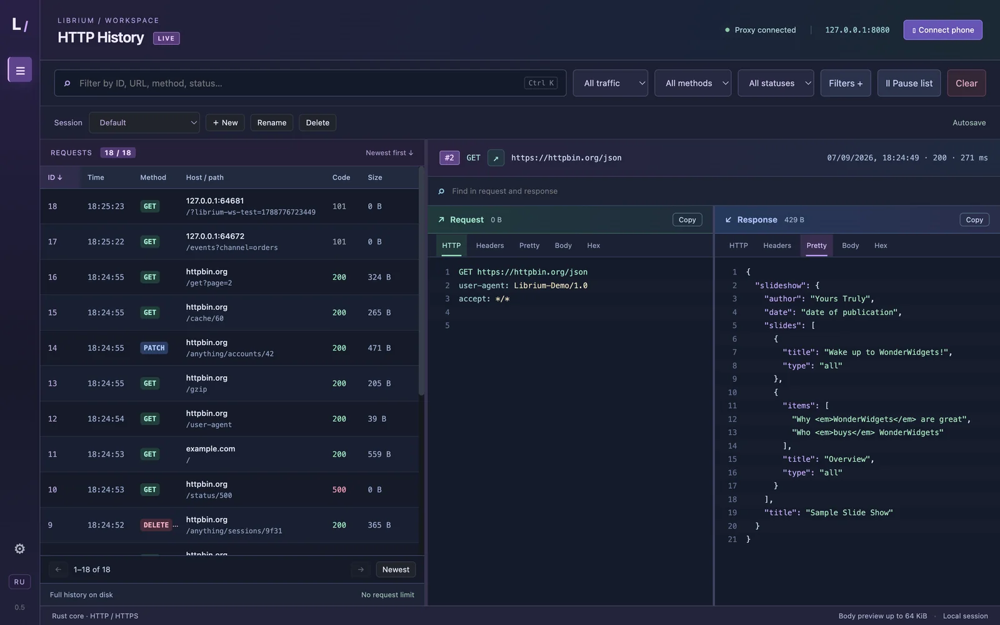
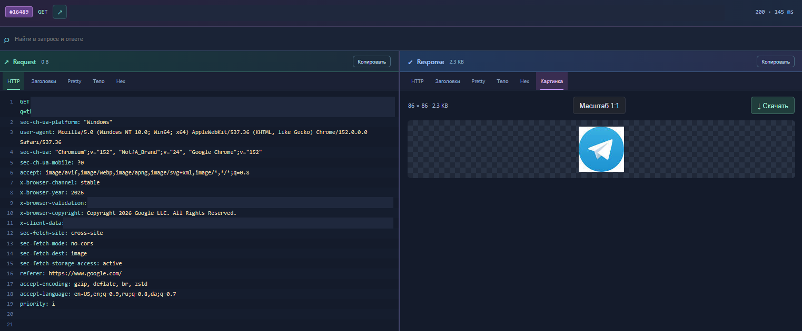

# Librium

Локальный инспектор HTTP, HTTPS и WebSocket для Windows. Rust-прокси и Electron-интерфейс в одном приложении.

## Возможности

- HTTP/1.1 и HTTP/2 через явный прокси; HTTPS с локальным CA.
- История в SQLite без автоматического удаления по числу запросов.
- Поиск, фильтры HTTP/WebSocket, именованные сессии с автосохранением.
- Сортировка всей истории по ID, методу, адресу, коду и размеру.
- Request и Response рядом: заголовки, текст, JSON, Hex, поиск и копирование URL.
- Просмотр PNG, SVG и других изображений, масштаб 1:1 и перетаскивание.
- Аудиоплеер и сохранение захваченных медиа в файл.
- WebSocket-сообщения в обе стороны: текст, бинарные данные, время и история.
- Опциональное подключение телефона в домашней сети.

## Скриншоты

История запросов и рабочая область:



Просмотр изображения в ответе. Параметры URL и служебные идентификаторы браузера скрыты:



## Сборка и запуск

Нужны Windows, актуальный стабильный Rust, Node.js 24 или новее, Visual Studio Build Tools с инструментами C++ и Windows SDK. Для некоторых нативных зависимостей может понадобиться CMake.

```powershell
npm ci
npm run build:core
npm start
```

Сборка portable-приложения: `npm run dist`. Результат находится в `dist/v<версия>/Librium <версия>.exe`. Пользователю готового приложения Node.js и Rust не нужны. Если используешь распакованный вариант, переноси папку `win-unpacked` целиком.

Только Rust-ядро: `./run.ps1` или `cargo run --locked`. Интерфейс/API ядра слушает `127.0.0.1:3000`, прокси — `127.0.0.1:8080`.

## Подключение HTTPS

При первом запуске Librium создаёт CA в `%LOCALAPPDATA%\Librium`. Укажи в нужном клиенте HTTP/HTTPS-прокси `127.0.0.1:8080` и добавь сертификат CA в доверенные сертификаты этого клиента. Настройка доступна в приложении.

Проверка без изменения системного хранилища сертификатов:

```powershell
curl.exe --ssl-revoke-best-effort --proxy http://127.0.0.1:8080 --cacert "$env:LOCALAPPDATA\Librium\ca.crt" https://example.com
```

Приложение не включает системный прокси и не устанавливает CA автоматически. После работы отключи прокси в клиенте. Приватный ключ `ca.key` никому не передавай.

Для телефона нажми «Подключить телефон», выбери локальный сетевой интерфейс и следуй инструкции. LAN-доступ включается отдельно; по умолчанию ядро доступно только на loopback.

## Хранение и ограничения

- История: `%LOCALAPPDATA%\Librium\history.sqlite3`, включая служебные WAL/SHM-файлы. Каталог можно изменить через `LIBRIUM_DATA_DIR`.
- Сессии фильтров и журналы: каталог данных Electron (`%APPDATA%\librium-desktop` при стандартном запуске).
- Для обычных HTTP-тел и каждого WebSocket-сообщения сохраняются первые 64 КиБ. Для изображений и аудио — до 32 МиБ. Сами данные передаются клиенту полностью.
- История записывается периодически и при штатном закрытии; при аварийном завершении последние изменения могут не сохраниться.
- HTTP/3/QUIC, прозрачный перехват всего трафика Windows и обход certificate pinning не реализованы. Клиент должен использовать прокси и доверять CA.

Используй Librium только для трафика, который имеешь право исследовать. История может содержать пароли, cookies и персональные данные: не включай её в репозиторий и публичные отчёты. Подробнее — [SECURITY.md](SECURITY.md).

## Проверки

```powershell
cargo test --locked
cargo clippy --locked --all-targets -- -D warnings
npm run test:ui
python scripts/export-source.py --check
```

Дополнительные проверки Electron и синтетических медиа описаны в [CONTRIBUTING.md](CONTRIBUTING.md).

## Подготовка исходников к публикации

```powershell
python scripts/export-source.py --check
python scripts/export-source.py
```

Экспорт создаёт новую папку `.publish/Librium` только с разрешёнными исходниками. В неё не копируются `.git`, локальные базы, сертификаты, трафик, логи, сборки и снимки экрана. Если рабочая Git-история содержит личные данные, публикуй новую историю из чистого экспорта, а не исходный репозиторий.

## Документация

- [Архитектура](docs/architecture.md) — проектные заметки; возможности текущей версии перечислены выше.
- [Сеть](docs/network.md), [протоколы](docs/basics/protocols.md).
- [TLS](docs/basics/tls-versions.md), [сертификаты](docs/basics/certificates.md), [CA](docs/basics/certificate-authorities.md).
- [Настройка прокси](docs/proxy-setup.md), [учебные примеры](docs/practice.md).

## Лицензия

Лицензия авторского кода пока не выбрана. До добавления файла `LICENSE` проект не следует представлять как лицензированный open-source. Сторонние зависимости сохраняют собственные лицензии; перед распространением бинарников нужно проверить их условия и необходимые уведомления.
