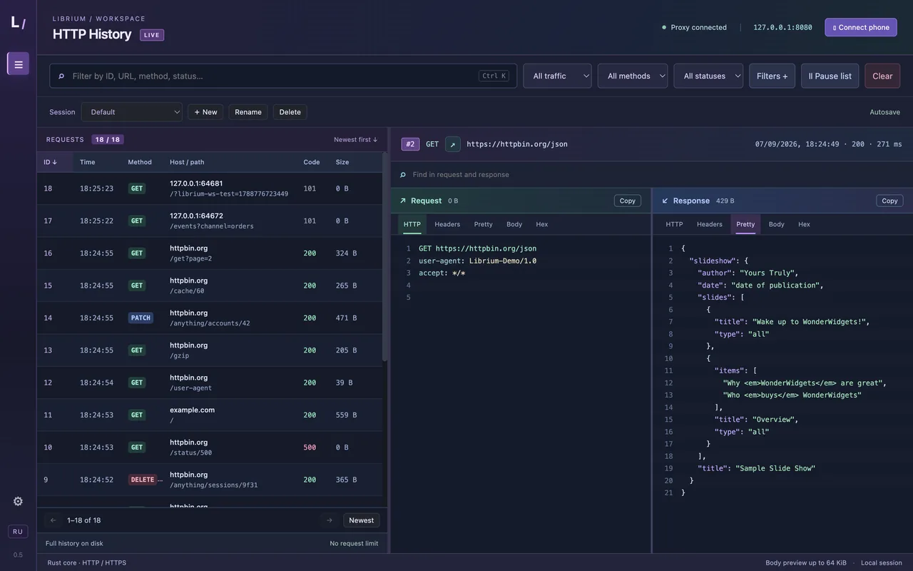

# Librium

[English](README.md) · **Русский**

**Смотри, что происходит между приложением и сетью.**

Librium — современный open-source инспектор HTTP, HTTPS и WebSocket для Windows и macOS. Прокси на Rust, полноценное десктопное приложение на Electron и история в SQLite: запросы, ответы, изображения, аудио и WebSocket-сообщения собраны в одном рабочем пространстве.

Разбирай API, отлаживай клиентские приложения, проверяй заголовки и изучай сетевое поведение. Цветной интерфейс помогает читать трафик, а сохранённые наборы фильтров — быстро возвращаться к нужной задаче.

[](https://github.com/Daloshka/Librium/actions/workflows/checks.yml)
[](https://github.com/Daloshka/Librium/releases/latest)
[](https://github.com/Daloshka/Librium/releases)
[](LICENSE)

**Rust + Electron · HTTP / HTTPS / WebSocket · SQLite · MIT**

[Возможности](#возможности) · [Скриншоты](#скриншоты) · [Установка](#установка) · [Настройка HTTPS](#подключение-https) · [Документация](#документация)



## Возможности

- HTTP/1.1 и HTTP/2 через явный прокси; HTTPS с локальным CA. Одна кнопка добавляет его в доверенные для текущего пользователя в macOS и Windows; система попросит подтверждение.
- История в SQLite без автоматического удаления по числу запросов.
- Поиск, фильтры HTTP/WebSocket, именованные сессии с автосохранением. Шумные хосты (`*.google-analytics.com`, `telemetry.*`) можно вовсе не записывать в историю: из настроек (шестерёнка слева) или из контекстного меню строки. В строке поиска условия пишутся рядом с обычными словами: `host:api status:4xx method:post type:json size:>1mb -path:/static`.
- Сортировка всей истории по ID, методу, адресу, коду, размеру и длительности; режим «Следить» сам открывает каждый новый запрос.
- Request и Response рядом: заголовки, параметры адреса и формы, cookies, текст, сворачиваемое дерево JSON, Hex, поиск и копирование URL.
- Просмотр PNG, SVG и других изображений, масштаб 1:1 и перетаскивание.
- Аудиоплеер и сохранение захваченных медиа в файл.
- WebSocket-сообщения в обе стороны: текст, бинарные данные, время и история.
- HAR в обе стороны: экспорт запросов под текущими фильтрами или всей истории (тела распакованы, WebSocket-кадры в формате Chrome DevTools) и импорт HAR из браузера, от коллеги или из другого инструмента в историю (файл можно просто перетащить в окно), вместе с WebSocket-кадрами. Учётные данные (Authorization, Cookie, Set-Cookie, ключи API) по умолчанию скрываются; переключатель — в диалоге «Фильтры». Любой запрос копируется как команда curl.
- Сводка по текущему поиску: пункт «Σ Сводка по выборке» в меню ⋯ на панели показывает итоги, долю ошибок, число ответов от моков, объём, медиану / 95-й перцентиль / максимум задержки, коды, методы и самые активные хосты; клик по хосту оставляет в поиске только его.
- Копировать как код: из меню строки запрос копируется как cURL, как вызов `fetch()` для браузера или как Python `requests`.
- Звёзды и заметки: отметить обмен из инспектора или меню строки и написать рядом заметку; `is:starred` и `note:` находят их снова.
- Новый запрос: «+ Запрос» открывает пустой редактор: метод, адрес, заголовки, тело (или вставьте команду cURL в поле адреса — всё заполнится само), отправка через прокси; редактор помнит последний составленный запрос; обмен попадает в историю как обычный.
- Переключатель записи: «● Запись» на панели останавливает запись истории, трафик идёт и правила действуют, перехват не держит; после перезапуска запись снова включена.
- Перехват: задерживать запросы к выбранным хостам, методам и путям до отправки, смотреть (несколько задержанных — вкладками), править метод, адрес, заголовки и тело, затем пропускать или отбрасывать. По желанию и ответы: код, заголовки и тело (показано распакованным; изменённое уходит без сжатия), а задержанный ответ можно сохранить как мок. По умолчанию выключен; без решения задержанное уходит как есть через десять минут.
- Моки: «Замокать этот ответ» в меню строки превращает записанный обмен в готовый ответ: прокси отдаёт его для подходящих хоста, пути и метода (шаблон пути с `?` учитывает и query), не обращаясь к серверу, и записывает обмен как обычно (с заголовком `x-librium-mock` и меткой «mock» в списке). Править, выключать и удалять моки можно в настройках.
- Правки заголовков: для подходящих хостов (при желании с шаблоном пути, `api.example.com/v1/*`) подставить или убрать заголовки запроса до отправки и заголовки ответа до того, как их увидит клиент (снять CSP, разрешить CORS, отключить кэш): вставить токен, убрать кэширующие заголовки, подменить User-Agent. В истории видно то, что реально ушло.
- Медленная сеть: задержка ответов подходящих хостов (при желании с шаблоном пути; до минуты), включая моки, чтобы посмотреть приложение на плохой связи; записанная длительность её включает.
- Правила файлом: в настройках можно выгрузить игнорируемые хосты, правки заголовков, задержки и моки одним JSON-файлом и загрузить такой файл обратно (он заменяет те списки, которые в нём есть; можно просто перетащить файл в окно), чтобы команда пользовалась одними моками.
- Активные правила: пока включены моки, задержки или правки заголовков, в шапке горит янтарная метка с их числом; клик открывает настройки, чтобы забытое правило не отвечало молча.
- Повтор запроса как есть или с правками: одна кнопка отправляет захваченный запрос ещё раз через прокси, другая сначала открывает его для редактирования — метод, адрес, заголовки и тело. Повтор появляется в истории рядом с оригиналом.
- Опциональное подключение телефона в домашней сети.
- Интерфейс на русском и английском, переключается кнопкой в приложении.
- Бесплатно и по лицензии MIT: без аккаунта, подписки и облака.

## Скриншоты

История запросов и рабочая область:


Просмотр изображения в ответе (синтетический демо-трафик):


## Librium и альтернативы

| | Бесплатно | Открытый код | Windows | macOS | Телефон по Wi-Fi | WebSocket | История на диске без лимита | Без аккаунта и облака |
| --- | --- | --- | --- | --- | --- | --- | --- | --- |
| **Librium** | Да | Да (MIT) | Да | Да | Да | Да | Да (SQLite) | Да |
| Charles | Нет (~$50 разово) | Нет | Да | Да | Да | Да | — | Да |
| Proxyman | Частично (freemium) | Нет | Да | Да | Да | Да | — | — |
| Fiddler Everywhere | Нет (подписка) | Нет | Да | Да | Да | Да | — | Нет (нужен вход) |
| mitmproxy | Да | Да | Да | Да | Да | Да | — | Да |
| HTTP Toolkit | Частично (есть free) | Да (ядро) | Да | Да | Да | Да | — | — |

«—» означает «зависит от тарифа или способа запуска», а не «нет такой возможности». Несколько уточнений, чтобы таблицу не читали шире, чем она есть:

- **Charles** — зрелый платный инструмент с разовой лицензией и ограниченной по времени пробной версией.
- **Proxyman** — аккуратное приложение, сделанное в первую очередь для macOS, со сборками для Windows и Linux; часть возможностей в платном тарифе.
- **Fiddler Everywhere** — платная подписка со входом в аккаунт Telerik.
- **mitmproxy** — бесплатный и открытый, но это CLI и веб-интерфейс, а не десктопное приложение.
- **HTTP Toolkit** — открытый код и платные возможности Pro.
- Большинство из них держит сессию в памяти и выгружает её по команде; Librium пишет историю в SQLite сразу, поэтому она переживает перезапуск без отдельного экспорта.

Возможности меняются. Если ячейка устарела — [заведи issue](https://github.com/Daloshka/Librium/issues), поправим.

## Установка

### Готовое приложение

Если для выбранной версии опубликована сборка, открой раздел [Releases](https://github.com/Daloshka/Librium/releases) этого репозитория.

**Windows.** Скачай `Librium.<версия>.exe` и запусти его. Portable-версия не требует установки Node.js или Rust. Для распакованной сборки сохраняй папку `win-unpacked` целиком.

**macOS.** Скачай `Librium-<версия>-arm64.dmg` (сборка для Apple Silicon; на Intel собери приложение из исходников — получится `Librium-<версия>-x64.dmg`), открой образ и перетащи Librium в «Программы». То же приложение есть и в виде `.zip`. Сборка подписана только ad-hoc, без Apple Developer ID, поэтому при первом запуске система откажется её открыть. Сними карантин с приложения:

```sh
xattr -dr com.apple.quarantine /Applications/Librium.app
```

Без терминала: после первого отказа открой Системные настройки → Конфиденциальность и безопасность и нажми «Всё равно открыть» (macOS 15 и новее); на более старых версиях достаточно правого клика по приложению → «Открыть».

Если готового релиза пока нет, собери приложение из исходников по инструкции ниже.

### Homebrew (macOS)

Apple Silicon, macOS 13 или новее (cask проверяет и то, и другое).

```sh
brew install --cask daloshka/tap/librium
xattr -dr com.apple.quarantine /Applications/Librium.app
```

Homebrew сохраняет атрибут карантина у скачанных приложений, поэтому вторая команда нужна один раз после каждой установки или обновления, пока сборки не нотаризованы.

### Scoop (Windows)

```powershell
scoop bucket add daloshka https://github.com/Daloshka/scoop-bucket
scoop install librium
```

### Из исходников

Скачай исходники через **Code → Download ZIP** и распакуй архив либо клонируй репозиторий. Открой PowerShell или терминал в папке с `package.json` и `Cargo.toml`.

**Windows.** Нужны актуальный стабильный Rust, Node.js 24 или новее, Visual Studio Build Tools с инструментами C++ и Windows SDK. Для некоторых нативных зависимостей может понадобиться CMake.

```powershell
npm ci
npm run build:core
npm start
```

**macOS.** Нужны Xcode Command Line Tools, Rust через [rustup](https://rustup.rs) и Node.js 24 или новее (`brew install node` либо nvm).

```sh
xcode-select --install
curl --proto '=https' --tlsv1.2 -sSf https://sh.rustup.rs | sh
npm ci
npm run build:core
npm start
```

Команда `npm run build:core` — обычный Node-скрипт, она одинаково работает и в PowerShell, и в терминале.

Чтобы собрать приложение для текущей системы:

```sh
npm run dist
```

Результат находится в `dist/v<версия>`: `Librium <версия>.exe` в Windows, `Librium-<версия>-arm64.dmg` (на Intel — `-x64.dmg`) и `.zip` в macOS.

Только Rust-ядро: `./run.sh` (macOS и Linux), `./run.ps1` (Windows) или `cargo run --locked`. Интерфейс/API ядра слушает `127.0.0.1:3000`, прокси — `127.0.0.1:8080`; оба порта настраиваются.

### Порты и каталоги

| Переменная | По умолчанию | Что задаёт |
| --- | --- | --- |
| `LIBRIUM_UI_PORT` | `3000` | Порт интерфейса и API ядра на `127.0.0.1`. |
| `LIBRIUM_PROXY_PORT` | `8080` | Порт HTTP/HTTPS-прокси на `127.0.0.1`. |
| `LIBRIUM_DATA_DIR` | каталог данных системы | Где лежат CA (`ca.crt`, `ca.key`) и история `history.sqlite3`. |

Порт страницы с сертификатом для телефона — на единицу больше порта прокси (по умолчанию `8081`), поэтому для прокси допустимы значения от `1` до `65534`.

macOS и Linux:

```sh
LIBRIUM_PROXY_PORT=8088 npm start
```

Windows, PowerShell:

```powershell
$env:LIBRIUM_PROXY_PORT=8088; npm start
```

Приложение передаёт эти значения ядру, поэтому задавать их достаточно один раз при запуске. Актуальный адрес прокси показан в шапке приложения.

## Быстрый старт

1. Запусти Librium и дождись подключения прокси.
2. В браузере или приложении укажи HTTP-прокси `127.0.0.1:8080`. Для HTTPS настрой доверие к локальному сертификату по инструкции ниже.
3. Открой страницу или выполни запрос — он появится в истории.
4. Выбери строку: слева отображается запрос, справа — ответ. Переключайся между заголовками, телом, Pretty и Hex; для медиа доступны просмотр, воспроизведение и скачивание.
5. Используй поиск и фильтры по типу трафика, методу и статусу. Сохрани набор в отдельную сессию фильтров, чтобы вернуться к нему после перезапуска.

Новые запросы по умолчанию появляются сверху. Нажатие на заголовок столбца меняет сортировку.

Интерфейс есть на русском и английском: кнопка **RU / EN** внизу левой панели переключает язык и перезагружает окно. При первом запуске Librium берёт язык системы.

### Синтаксис поиска

Обычные слова ищутся в ID, методе, адресе, статусе и типе содержимого. Условия сужают список; все они действуют одновременно, вместе с быстрыми фильтрами и конструктором фильтров. Правый клик по строке предлагает те же условия для её хоста, пути, метода и кода, а также копирование URL, повтор, построчное сравнение с ранее выбранным запросом и удаление из истории. «Удалить подходящие» рядом с чипами условий удаляет всё, что подходит под текущие условия, после подтверждения.

| Условие | Значение |
| --- | --- |
| `host:api` · `path:/v1/` · `url:token` | содержит |
| `host:=api.example.com` | точное значение |
| `-host:cdn` · `-path:/static` | не содержит |
| `method:post` · `-method:get` | метод равен / отличается |
| `status:404` · `status:4xx` · `status:>=400` · `status:<500` · `status:!=200` | код или класс ответа |
| `size:>1mb` · `size:<=20kb` · `id:>1000` | размер и ID с единицами и сравнениями |
| `type:json` · `type:image` | тип содержимого содержит |
| `body:token` · `-body:error` | текст тела запроса или ответа содержит (первые 16 КиБ каждого, распакованные из gzip, deflate и brotli; у запросов, захваченных до этой версии, текста тела нет) |
| `header:set-cookie` · `header:"cache-control: no-store"` | строка заголовка запроса или ответа содержит (`имя: значение`, в нижнем регистре, первые 8 КиБ строк) |
| `frame:ping` · `-frame:error` | WebSocket-соединения, в которых есть кадр с таким текстом (первые 64 КиБ каждого кадра) |
| `is:error` · `-is:error` · `is:pending` | обмены с ошибкой или обрывом; обмены без ответа |
| `is:starred` · `note:todo` | отмеченные звездой; заметка содержит (обычные слова ищут и по заметкам) |
| `is:mock` | обмены, на которые ответил мок, а не сервер |
| `since:10m` · `since:2h` · `since:14:30` · `since:2026-09-08` · `until:2026-09-08 18:00` | время запроса: последние минуты, часы или дни, время сегодня, либо локальные дата и время |
| `elapsed:>1s` · `elapsed:<200` | время до первого байта ответа (миллисекунды или секунды с `s`) |
| `"два слова"` | слова не разрываются |

Подсказки появляются под полем по мере ввода: сначала поля, затем значения из истории (хосты, пути, методы, статусы, типы содержимого) и примеры синтаксиса. ↑ ↓ выбирают, Tab или Enter подставляет, Esc закрывает список. Пустое поле показывает и восемь последних запросов (Enter или уход из поля запоминает запрос).

### Клавиши

| Клавиши | Действие |
| --- | --- |
| `Ctrl K` (`⌘ K` в macOS) | Курсор в поиск по истории |
| `Ctrl F` (`⌘ F`) | Курсор в поиск по запросу и ответу |
| `Ctrl I` (`⌘ I`) | Включить или выключить перехват |
| `Ctrl N` (`⌘ N`) | Новый запрос |
| `Ctrl Shift M` (`⌘ ⇧ M`) | Замокать выбранный ответ |
| `Ctrl ]` / `Ctrl [` (`⌘ ]` / `⌘ [`) | В панели перехвата: следующий / предыдущий задержанный |
| `?` | Шпаргалка по клавишам и синтаксису поиска (и кнопка `?` в рейле) |
| `Ctrl D` (`⌘ D`) | Отметить звездой или снять звезду с выбранного запроса |
| `Esc` | Очистить поле поиска под курсором |
| `↑` `↓` `Enter` | Ходить по истории и открывать запрос |
| `Ctrl Enter` (`⌘ Enter`) | Отправить из диалога «Изменить и отправить» |

## Подключение HTTPS

При первом запуске Librium создаёт CA в каталоге данных:

| ОС | Каталог |
| --- | --- |
| Windows | `%LOCALAPPDATA%\Librium` |
| macOS | `~/Library/Application Support/Librium` |
| Linux | `~/.local/share/librium` |

Укажи в нужном клиенте HTTP/HTTPS-прокси `127.0.0.1:8080` и добавь `ca.crt` в доверенные сертификаты этого клиента. Скачать сертификат и прочитать инструкцию можно прямо в приложении.

Проверка без изменения системного хранилища сертификатов — в PowerShell:

```powershell
curl.exe --ssl-revoke-best-effort --proxy http://127.0.0.1:8080 --cacert "$env:LOCALAPPDATA\Librium\ca.crt" https://example.com
```

В терминале macOS:

```sh
curl --proxy http://127.0.0.1:8080 --cacert "$HOME/Library/Application Support/Librium/ca.crt" https://example.com
```

Доверие к CA в macOS включается в «Связке ключей»: открой `ca.crt`, найди **Librium Local CA** и в разделе «Доверие» выбери «Всегда доверять». То же самое из терминала:

```sh
security add-trusted-cert -r trustRoot -k ~/Library/Keychains/login.keychain-db "$HOME/Library/Application Support/Librium/ca.crt"
```

Системный прокси в macOS задаётся отдельно для каждого интерфейса: Системные настройки → Сеть → интерфейс → Подробнее… → Прокси → «Веб-прокси (HTTP)» и «Защищённый веб-прокси (HTTPS)» со значениями `127.0.0.1` и `8080`. Включить то же из терминала (вместо `Wi-Fi` подставь имя своего сетевого сервиса из `networksetup -listallnetworkservices`):

```sh
networksetup -setwebproxy Wi-Fi 127.0.0.1 8080
networksetup -setsecurewebproxy Wi-Fi 127.0.0.1 8080
```

Выключить после работы:

```sh
networksetup -setwebproxystate Wi-Fi off
networksetup -setsecurewebproxystate Wi-Fi off
```

Приложение не включает системный прокси и не устанавливает CA автоматически. После работы отключи прокси в клиенте или в системе. Приватный ключ `ca.key` никому не передавай.

### Если включён VPN

VPN-клиенты на базе Network Extension в macOS (Xray, sing-box, Amnezia, WireGuard и подобные) и многие туннели в Windows игнорируют системный прокси: пока туннель поднят, `scutil --proxy` пуст, и запросы идут мимо Librium, даже если прокси задан для Wi-Fi или для самого сервиса VPN. Librium при этом работает: его исходящие соединения уходят через туннель, как у любого приложения.

Решение — задать прокси самому браузеру, а не системе. Кнопка **«Открыть Chrome через прокси»** в диалоге «Подключение HTTPS» запускает отдельный профиль Chrome, Chromium, Edge или Brave с флагом `--proxy-server`, который не зависит от системных настроек и VPN. Профиль хранится в каталоге данных Electron и не трогает основной браузер. То же вручную:

```sh
open -na "Google Chrome" --args --proxy-server=127.0.0.1:8080 --user-data-dir="$HOME/Library/Application Support/librium-desktop/chrome-profile"
```

```powershell
& "$env:ProgramFiles\Google\Chrome\Application\chrome.exe" --proxy-server=127.0.0.1:8080 --user-data-dir="$env:APPDATA\librium-desktop\chrome-profile"
```

Firefox настраивается в собственных параметрах сети: «Ручная настройка прокси», HTTP и HTTPS `127.0.0.1:8080`. Для HTTPS в любом случае нужен доверенный CA Librium.

Подробные разборы: [настройка прокси в Windows](docs/proxy-setup.md) и [настройка прокси в macOS](docs/proxy-setup-macos.md).

Для телефона нажми «Подключить телефон», выбери локальный сетевой интерфейс и следуй инструкции. LAN-доступ включается отдельно; по умолчанию ядро доступно только на loopback.

### Подключение телефона

Подключи телефон и компьютер к одной домашней сети. В настройках Wi-Fi телефона укажи адрес компьютера, показанный Librium, и порт прокси `8080`. Для HTTPS установи локальный CA на телефон и включи доверие к нему, если этого требует система. В Windows разреши входящие подключения Librium в брандмауэре для частной сети. В macOS, если брандмауэр включён, разреши входящие для Librium (Системные настройки → Сеть → Брандмауэр → Параметры…): при первом включении LAN-доступа система предложит это сама.

После работы отключи прокси на телефоне. Некоторые приложения игнорируют системный прокси или не доверяют пользовательским сертификатам — их трафик может быть недоступен для просмотра.

## Если что-то не работает

| Симптом | Что проверить |
| --- | --- |
| В истории пусто | Клиент действительно использует прокси `127.0.0.1:8080`; активные фильтры не скрывают запросы. Сам запуск Librium не перенаправляет весь трафик системы. |
| Ошибка сертификата HTTPS | Клиент доверяет CA, созданному этой копией Librium. В некоторых клиентах нужно явно указать файл сертификата. |
| `ECONNREFUSED 127.0.0.1:3000` | Rust-ядро не запущено или завершилось. Для запуска из исходников выполни `npm run build:core` и перезапусти приложение; проверь, что порт `3000` свободен, или задай другой через `LIBRIUM_UI_PORT`. |
| Порт `8080` занят другим приложением | Запусти с `LIBRIUM_PROXY_PORT=<порт>`; в клиенте укажи этот же порт. Адрес прокси показан в шапке приложения. |
| macOS: «Librium повреждён» или «не удаётся открыть» | Сборка не подписана Apple Developer ID. Сними карантин: `xattr -dr com.apple.quarantine /Applications/Librium.app`, либо после отказа нажми «Всё равно открыть» в Системные настройки → Конфиденциальность и безопасность. |
| Телефон не подключается | Устройства в одной сети, LAN-доступ включён, указан адрес компьютера, а брандмауэр разрешает соединения. |
| Вместо картинки ответ `301` или `302` | Это перенаправление. Открой захваченный запрос по адресу из `Location`: изображение находится в конечном ответе. |
| В шапке «История не сохраняется» | Ядро не может записать `history.sqlite3`: закончилось место, файл только для чтения или другая программа держит базу в открытой транзакции записи. Трафик тем временем идёт через прокси и будет записан, когда проблема исчезнет; в баннере показана ошибка SQLite. |

## Хранение и ограничения

История лежит в каталоге данных вместе с CA и служебными WAL/SHM-файлами:

| ОС | Файл истории |
| --- | --- |
| Windows | `%LOCALAPPDATA%\Librium\history.sqlite3` |
| macOS | `~/Library/Application Support/Librium/history.sqlite3` |
| Linux | `~/.local/share/librium/history.sqlite3` |

- Каталог можно изменить через `LIBRIUM_DATA_DIR`.
- Сессии фильтров и журналы: каталог данных Electron (`%APPDATA%\librium-desktop` в Windows, `~/Library/Application Support/librium-desktop` в macOS).
- Для обычных HTTP-тел и каждого WebSocket-сообщения сохраняются первые 64 КиБ. Для изображений и аудио — до 32 МиБ. Сами данные передаются клиенту полностью. Тела, сжатые gzip, deflate, brotli или zstd, показываются, сохраняются и экспортируются распакованными; вкладка Hex хранит байты как есть. Распакованный текст первых 16 КиБ каждого тела хранится рядом с каждым обменом для поиска `body:`.
- История записывается каждые полсекунды и при закрытии; в подвале показано, сколько она занимает на диске. При закрытии приложение просит ядро дописать всё перед выходом; после аварийного завершения или отключения питания последние мгновения могут не сохраниться.
- HTTP/3/QUIC, прозрачный перехват всего трафика системы и обход certificate pinning не реализованы. Клиент должен использовать прокси и доверять CA.

Используй Librium только для трафика, который имеешь право исследовать. История может содержать пароли, cookies и персональные данные: не включай её в репозиторий и публичные отчёты. Подробнее — [SECURITY.md](SECURITY.md).

## Проверки

Команды одинаковы в PowerShell и в терминале macOS; в Windows вместо `python3` обычно `python`.

```sh
cargo test --locked
cargo clippy --locked --all-targets -- -D warnings
npm run test:ui
python3 scripts/export-source.py --check
```

Дополнительные проверки Electron и синтетических медиа описаны в [CONTRIBUTING.md](CONTRIBUTING.md).

## Подготовка исходников к публикации

```sh
python3 scripts/export-source.py --check
python3 scripts/export-source.py
```

Экспорт создаёт новую папку `.publish/Librium` только с разрешёнными исходниками и двумя подготовленными скриншотами документации. В неё не копируются `.git`, локальные базы, сертификаты, трафик, логи, сборки и произвольные снимки экрана. Папка назначения должна быть новой или пустой. Если рабочая Git-история содержит личные данные, публикуй новую историю из чистого экспорта, а не исходный репозиторий.

## Документация

- [Архитектура](docs/architecture.md) — проектные заметки; возможности текущей версии перечислены выше.
- [Сеть](docs/network.md), [протоколы](docs/basics/protocols.md).
- [TLS](docs/basics/tls-versions.md), [сертификаты](docs/basics/certificates.md), [CA](docs/basics/certificate-authorities.md).
- [Настройка прокси в Windows](docs/proxy-setup.md), [настройка прокси в macOS](docs/proxy-setup-macos.md), [учебные примеры](docs/practice.md).
- [Выпуск релиза](docs/release.md) — версии, теги, подпись и нотаризация, обновление Homebrew tap и Scoop bucket.

Файлы `CONTRIBUTING.md` и `SECURITY.md` написаны на английском; подробные материалы в `docs/` — на русском.

## Лицензия

Код Librium распространяется по [MIT License](LICENSE). Можно использовать проект, изменять его и распространять, в том числе в коммерческих продуктах, сохраняя уведомление об авторских правах и текст лицензии.

Сторонние зависимости и показанные в демонстрационных материалах сторонние изображения сохраняют собственные лицензии и права. Текст MIT: [Open Source Initiative](https://opensource.org/license/mit).

## Участие в проекте

Нашёл ошибку или придумал улучшение — создай Issue или предложи Pull Request. Для багов укажи версию Librium, шаги воспроизведения и ожидаемый результат. Прикладывай только обезличенные примеры без cookies, токенов и личного трафика.

Инструкции для разработки и проверок — в [CONTRIBUTING.md](CONTRIBUTING.md), рекомендации по работе с чувствительными данными — в [SECURITY.md](SECURITY.md).
